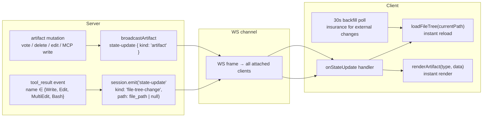

# WS Push File-Tracking Design

Date: 2026-05-30
Status: approved

## Problem

Commit `96320ad` added 5s HTTP polling (`_startArtifactAutoRefresh` / `_startFileTreeAutoRefresh`) to keep plan/todo/bug artifact views and the workspace file tree current without manual page refreshes. This has two downsides:

1. **Unnecessary HTTP round-trips** — every 5s per client, even when nothing changed. Artifact polling is entirely redundant because the WS `state-update { kind: 'artifact' }` channel already pushes on every mutation (vote, comment, delete, edit, agent MCP write).
2. **Up to 5s latency** — the client sees file-tree changes only at the next poll tick, not when the agent actually writes the file.

## Goal

Replace HTTP polling with WS push for agent-driven and UI-driven changes, keeping a reduced backfill poll (30s) only as insurance for external mutations the server cannot observe.

## Design

### 1. Remove artifact auto-refresh polling entirely

The WS `state-update { kind: 'artifact' }` channel already covers every mutation path:

| Mutation source | How WS push reaches the client |
|---|---|
| Agent MCP tool (Write/Edit plan.json) | `myco-mcp.js` → `broadcastArtifact` → `state-update { kind: 'artifact' }` |
| Slash command (/td, /fr, /bug) | `slashcmds.js` → `broadcastArtifact` → `state-update { kind: 'artifact' }` |
| UI delete item/comment | `artifacts.js DELETE /artifact/item` → `broadcastArtifact` → `state-update { kind: 'artifact' }` |
| UI vote / mark / edit | `artifacts.js POST/PATCH` → `broadcastArtifact` → `state-update { kind: 'artifact' }` |
| Run-queue dispatch/finish | `slashcmds.js` → `state-update { kind: 'runQueue' }` (already separate) |

Every attached WS client already receives these frames and calls `renderArtifact` on receipt. The 5s `forceHttp` poll adds zero new information — it re-fetches the same state that the WS already delivered.

Changes:
- Remove `_startArtifactAutoRefresh`, `_stopArtifactAutoRefresh`, `_artifactAutoRefreshHandle`, `ARTIFACT_AUTO_REFRESH_MS`.
- Remove `{ forceHttp }` option from `loadArtifact` — restore original cache-first logic (WS cache → HTTP fallback on cold load).
- Remove all call sites: `showArtifactView`, `hideArtifactView`, `showFilesView`, `_resetUiForNewSession`.
- Remove the `forceHttp` parameter from the `loadArtifact` function signature and the `if (!forceHttp && cachedHas)` branch.

### 2. Add WS push for file-tree changes on agent tool calls

The agent session already sees every `tool_use` / `tool_result` event with `{ name, input }`. When the agent calls a file-writing tool, the server can push a `file-tree-change` state-update over WS so the client reloads the tree immediately.

Hook point: `agent-session.js` — both the opencode `tool_result` handler (line ~791) and the Anthropic `tool_result` handler (line ~992). Both paths emit `_emit({ type: 'tool_result', ... })`, but with different shapes. The hook must cover both.

Using `tool_result` instead of `tool_use` avoids pushing for writes that failed. Both paths already track open tool calls via `this.openToolCalls` — when a `tool_result` arrives, the corresponding `tool_use` record is still in the map, providing the `name` and `input` even for the Anthropic path where the result message only carries `tool_use_id`.

```js
const FILE_WRITING_TOOL_NAMES = ['Write', 'Edit', 'MultiEdit'];
// Bash is special — we can't know which files changed, so emit a generic signal.
```

Implementation: after each `tool_result` emit, check `this.openToolCalls` for the tool's name (if still present) OR look at the already-emitted event. If the tool name is in `FILE_WRITING_TOOL_NAMES`, emit the file-tree-change. For Bash, emit a generic signal. Skip if `is_error` / `isError` is true.

On `tool_result` for a tool in `FILE_WRITING_TOOL_NAMES`:
- Emit `session.emit('state-update', { kind: 'file-tree-change', path: input.file_path })`

On `tool_result` for `Bash`:
- Emit `session.emit('state-update', { kind: 'file-tree-change', path: null })`
- `path: null` means "something may have changed, recheck everything"

Note: for the Anthropic path, `openToolCalls.delete(block.tool_use_id)` happens at line 993 BEFORE the `_emit` at line 999. To retrieve the name + input, we must either (a) read them before the delete, or (b) store a side map of `tool_use_id → { name, input }` at the `tool_use` event and look it up at `tool_result` time. Option (b) is cleaner and works for both paths.

The `path` field enables future targeted refresh (only reload the affected directory). For now the client treats any `file-tree-change` as a full-tree reload.

### 3. Client-side handler for `file-tree-change` WS frame

In `app.js`, inside the existing `onStateUpdate` handler that processes `state-update` frames:

```js
if (payload.kind === 'file-tree-change') {
  if (state.files.visible && state.activeId) {
    loadFileTree(state.files.currentPath || '.');
  }
}
```

This gives sub-second feedback when the agent writes files, compared to the current up-to-5s poll delay.

### 4. Reduce backfill poll to 30s

The 5s file-tree poll remains as insurance for changes the server cannot observe (external git ops, manual file edits outside the agent, CI). Reduce to 30s — 2 requests/min per client instead of 12.

```js
const FILE_TREE_AUTO_REFRESH_MS = 30000; // was 5000
```

No other changes to the backfill mechanism — still skips `document.hidden`, still idempotent start/stop, still mutual exclusion with artifact view (which now has no polling of its own).

### 5. Keep artifact cache-first logic for cold loads

After removing `forceHttp`, `loadArtifact` reverts to:
1. Check WS cache (`state.artifacts.byType[type]`) — if populated and bound to current session, render immediately (0 network cost).
2. Cache miss → HTTP fetch (`GET /sessions/:id/artifact?type=X`) — happens on cold reload before WS attach delivers `artifacts-init`.

This is the pre-`96320ad` behavior and works correctly because `artifacts-init` always fills the cache on WS attach.

## Files changed

| File | Change |
|---|---|
| `server/src/agent-session.js` | Add `FILE_WRITING_TOOL_NAMES` set; emit `state-update { kind: 'file-tree-change', path }` on `tool_result` for writing tools and Bash |
| `web/public/app.js` | Remove artifact auto-refresh functions + `forceHttp` option; add `file-tree-change` handler in WS state-update processor; change `FILE_TREE_AUTO_REFRESH_MS` from 5000 to 30000 |
| `test/artifact-file-tree-autorefresh.test.js` | Update assertions: remove artifact-polling checks; keep file-tree backfill checks with 30s cadence; add assertion for `file-tree-change` WS handler shape |
| `test/test.sh` | Update grep guards to match new function signatures (remove artifact auto-refresh guards; add `file-tree-change` handler guard) |

## Data flow



## Regression test coverage

Existing test `test/artifact-file-tree-autorefresh.test.js` must be updated:
- Remove assertions for `_startArtifactAutoRefresh` / `_stopArtifactAutoRefresh` / `ARTIFACT_AUTO_REFRESH_MS` / `forceHttp`.
- Keep assertions for `_startFileTreeAutoRefresh` / `_stopFileTreeAutoRefresh` / `FILE_TREE_AUTO_REFRESH_MS` with new value 30000.
- Add assertion that `app.js` contains a `file-tree-change` handler in the WS state-update processing block.
- Add assertion that `agent-session.js` contains `FILE_WRITING_TOOL_NAMES` and emits `state-update { kind: 'file-tree-change' }`.

New test `test/ws-push-file-tree.test.js`:
- Mock `tool_result` events for Write/Edit/Bash → verify `session.emit('state-update', { kind: 'file-tree-change', ... })` fires.
- Verify Bash emits `{ path: null }`, Write/Edit emit `{ path: input.file_path }`.
- Verify tools NOT in the writing set (e.g. Read, Glob) do NOT emit `file-tree-change`.

## Edge cases

- **Tool result error**: if `tool_result.is_error === true`, skip the `file-tree-change` emit — the write failed, no tree change to signal.
- **Bash with no file changes**: `path: null` is a "maybe changed" signal. The client reloads the tree; if nothing changed, the HTTP response is the same data and the render is a no-op (same entries, same order).
- **Multiple rapid tool calls**: agent may call Write 5 times in one turn. Each `tool_result` emits a `file-tree-change`. The client's `loadFileTree` calls stack up; the last one renders the correct final state. Earlier intermediate renders are harmless (they show a progressively updating tree) and natural for a streaming UX.
- **Tab hidden**: the WS handler skips reload when `document.hidden` — same as the current poll skip. When the tab becomes visible again, the 30s backfill poll will catch any missed changes within 30s, and the client also re-evaluates on `visibilitychange` (could add an immediate reload on tab focus if desired, but the 30s backfill covers it).
- **WS reconnect**: on reconnect, `?afterSeq=N` catch-up delivers any `file-tree-change` frames that arrived during the disconnect. The client processes them on arrival, same as live.