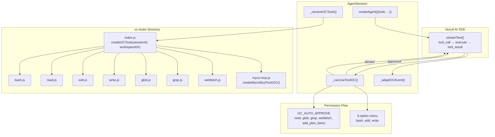

# OC Vercel SDK Tool Parity — Design Spec

**Date**: 2026-06-01
**Branch**: feature branch (7 commits after `d264eb49`)
**Goal**: Enable OpenCode Vercel SDK path agents with the same core tool capabilities as Claude SDK path agents, starting with the 8 essential file/shell tools.

## Problem Statement

The OC Vercel SDK path (`@opencode-ai/agent-sdk`) currently provides agents only `mcp__myco__add_plan_items` — a single tool for adding plan items. The Claude SDK path (`@anthropic-ai/claude-agent-sdk`) provides a full suite of built-in tools (Bash, Read, Edit, Write, Glob, Grep, WebFetch) via the Claude Code child process, plus lean-ctx MCP sidecar for context compression.

The root cause: Claude SDK spawns a Claude Code child process with all built-in tools compiled in. The OC SDK calls `streamText()` directly — the LLM only gets tools explicitly passed in the `tools` parameter of `createAgent()`. Without file/shell tools, OC agents are fundamentally incapable of doing real software engineering work.

## Scope

**This pass**: 8 core file/shell tools (bash, read, edit, write, glob, grep, webfetch) + permission gating integration + workspace anchoring.

**Deferred to future passes**: lean-ctx MCP sidecar, AskUserQuestion, skills, auto-memory, task (subagent dispatch), todo, question, search.

## Architecture

### Per-Tool Module Directory

New directory `server/src/oc-tools/` with one file per tool:

```
server/src/oc-tools/
  bash.js        → exports createBashTool(sessionId, workspaceDir)
  read.js        → exports createReadTool(sessionId, workspaceDir)
  edit.js        → exports createEditTool(sessionId, workspaceDir)
  write.js       → exports createWriteTool(sessionId, workspaceDir)
  glob.js        → exports createGlobTool(sessionId, workspaceDir)
  grep.js        → exports createGrepTool(sessionId, workspaceDir)
  webfetch.js    → exports createWebFetchTool(sessionId, workspaceDir)
  index.js       → aggregates all 8 + createMycoMcpToolsOC → Record<string, Tool>
```

Each per-tool module exports a single function returning `agentSdk.tool({description, inputSchema, execute})`. Tool implementations use plain Node.js — `child_process` for Bash, `fs` for Read/Write/Edit, `fast-glob` for Glob, `child_process.exec('rg')` for Grep, native `fetch()` for WebFetch.

### Aggregator: `index.js`

```js
const { createMycoMcpToolsOC } = require('../myco-mcp');
const { createBashTool } = require('./bash');
const { createReadTool } = require('./read');
const { createEditTool } = require('./edit');
const { createWriteTool } = require('./write');
const { createGlobTool } = require('./glob');
const { createGrepTool } = require('./grep');
const { createWebFetchTool } = require('./webfetch');

function createOCTools(sessionId, workspaceDir) {
  const mycoTools = createMycoMcpToolsOC(sessionId);
  const coreTools = {
    bash: createBashTool(sessionId, workspaceDir),
    read: createReadTool(sessionId, workspaceDir),
    edit: createEditTool(sessionId, workspaceDir),
    write: createWriteTool(sessionId, workspaceDir),
    glob: createGlobTool(sessionId, workspaceDir),
    grep: createGrepTool(sessionId, workspaceDir),
    webfetch: createWebFetchTool(sessionId, workspaceDir),
  };
  return { ...mycoTools, ...coreTools };
}

module.exports = { createOCTools };
```

### Integration with `agent-session.js`

Change `_resolveOCTools()` (currently at line 916-919) to call `createOCTools(this._sessionId, this._workspaceDir)` instead of `createMycoMcpToolsOC(sessionId)`.

`this._workspaceDir` is the session workspace directory (the folder containing CLAUDE.md, `_myco_/`, and the project source). This is the same path used as `options.cwd` when launching the OC agent.

## Tool Definitions

### bash

| Field | Value |
|-------|-------|
| **Parameters** | `{command: string, timeout?: number, workdir?: string, description?: string}` |
| **Execute** | `child_process.exec(command, {cwd: workdir || workspaceDir, timeout: timeout || 120000})` — captures stdout+stderr, returns as text string. |
| **Auto-approve** | No — gated (requires user approval via chat-pane menu) |

`workdir` override parameter matches the convention from the system prompt's Bash instructions. Default `cwd` is `workspaceDir`.

### read

| Field | Value |
|-------|-------|
| **Parameters** | `{filePath: string, offset?: number, limit?: number}` |
| **Execute** | `fs.readFile(resolve(filePath))` — returns file content with line-number prefix (`1: content\n`). If `filePath` is a directory, returns directory listing (entries + `/` suffix for subdirs). Truncates lines > 2000 chars. |
| **Auto-approve** | Yes — auto-approved |

Relative `filePath` resolves against `workspaceDir`. `offset` and `limit` are 1-indexed line ranges (matching Claude SDK's Read behavior).

### edit

| Field | Value |
|-------|-------|
| **Parameters** | `{filePath: string, oldString: string, newString: string, replaceAll?: boolean}` |
| **Execute** | Read file, find exact `oldString` substring, replace with `newString`, write back. Error if `oldString` not found. Error if multiple matches found and `replaceAll` is not true. |
| **Auto-approve** | No — gated |

Uses exact string replacement (not line-based diffs) — same as Claude SDK's Edit tool. Avoids ambiguity from line-number drift. The execute function reads the file first to locate `oldString`, then writes the modified content back.

### write

| Field | Value |
|-------|-------|
| **Parameters** | `{filePath: string, content: string}` |
| **Execute** | `fs.writeFile(resolve(filePath), content)` — creates/overwrites file. Creates parent directories if needed (`mkdirSync` with `recursive: true`). |
| **Auto-approve** | No — gated |

Relative `filePath` resolves against `workspaceDir`.

### glob

| Field | Value |
|-------|-------|
| **Parameters** | `{pattern: string, path?: string}` |
| **Execute** | Uses `fast-glob` package to find files matching `pattern` under `path || workspaceDir`. Returns sorted file paths. |
| **Auto-approve** | Yes — auto-approved |

### grep

| Field | Value |
|-------|-------|
| **Parameters** | `{pattern: string, include?: string, path?: string}` |
| **Execute** | Uses ripgrep (`rg`) via `child_process.exec`. `pattern` is regex pattern. `include` filters file extensions (e.g. `*.js`). Returns file paths + line numbers with matches. |
| **Auto-approve** | Yes — auto-approved |

Falls back to a Node.js-based search if `rg` is not available on the system (for environments without ripgrep installed).

### webfetch

| Field | Value |
|-------|-------|
| **Parameters** | `{url: string, format?: "text"|"markdown"|"html"}` |
| **Execute** | Native `fetch(url)` with basic HTML-to-text conversion (strip tags, preserve structure) for default format. Returns fetched content. No external markdown library dependency — uses a simple regex-based HTML cleaner. |
| **Auto-approve** | Yes — auto-approved |

Default format is `"markdown"` (HTML responses are converted). `"text"` returns raw text. `"html"` returns raw HTML.

## Permission Gating

### Auto-approve Set

```js
const OC_AUTO_APPROVE = new Set([
  'read', 'glob', 'grep', 'webfetch',
  'mcp__myco__add_plan_items'
]);
```

### Modified `_canUseToolOC` Logic

```js
async _canUseToolOC(toolName, toolInput) {
  const hookResult = this._preToolUseHookCheck(toolName, toolInput);
  if (hookResult) return hookResult;

  if (OC_AUTO_APPROVE.has(toolName)) {
    return { approved: true };
  }

  return this._popOCPermissionMenu(toolName, toolInput);
}
```

Destructive tools (bash, edit, write) still require explicit user approval through the chat-pane 3-option menu — matching the Claude SDK's `permissionMode: 'default'` behavior.

## System Prompt & Event Adaptation

**System prompt**: No changes needed. The existing CLAUDE.md references tools by their Claude SDK names (bash, read, edit, etc.), which match the OC tool names exactly.

**Event adaptation**: `_adaptOCEvent()` already handles `tool_call` and `tool_result` events generically — it maps any tool_call to `{type: 'tool_use', toolName, toolInput}` regardless of which specific tool was invoked. No structural changes needed for 8 additional tools.

**Tool execution loop**: The Vercel AI SDK's `streamText()` handles the tool_call → execute → tool_result round-trip internally. The `createAgent()` call passes `tools` and `canUseTool`, and the SDK calls each tool's `execute()` function when the LLM invokes it. We don't need to manually manage the tool execution loop.

## Testing

### 6 Regression Tests

1. **Tool registration test** (`test/oc-tools.test.js`): Verify `createOCTools(sessionId, workspaceDir)` returns all 9 tools (8 core + `mcp__myco__add_plan_items`). Check each tool has `description`, `inputSchema`, and `execute`.

2. **Schema validation test**: For each tool, verify `inputSchema` is a valid JSON Schema object with correct `properties` and `required` fields matching the spec above.

3. **Execute smoke tests**: For each tool, call `execute()` with valid input and verify return shape:
   - bash: `execute({command: 'echo hello'})` → string containing "hello"
   - read: `execute({filePath: '/tmp/test-read.txt'})` → file content with line numbers
   - edit: write temp file, call edit with oldString/newString, verify content changed
   - write: `execute({filePath: '/tmp/test-write.txt', content: 'test'})` → creates file
   - glob: `execute({pattern: '*.js', path: '/some/dir'})` → returns file paths
   - grep: `execute({pattern: 'hello', path: '/some/file'})` → returns matches
   - webfetch: `execute({url: 'https://example.com'})` → returns fetched content

4. **Permission gating test**: Verify `OC_AUTO_APPROVE` set includes read, glob, grep, webfetch, mcp__myco__add_plan_items. Verify bash, edit, write are NOT in the set.

5. **Workspace anchoring test**: Verify bash `cwd` defaults to `workspaceDir`. Verify read/edit/write/glob/grep resolve relative paths against `workspaceDir`.

6. **Integration test**: Verify `_resolveOCTools()` returns the combined tool map (not just `mcp__myco__add_plan_items`).

## Data Flow



## Files Changed

| File | Change |
|------|--------|
| `server/src/oc-tools/bash.js` | New — bash tool definition |
| `server/src/oc-tools/read.js` | New — read tool definition |
| `server/src/oc-tools/edit.js` | New — edit tool definition |
| `server/src/oc-tools/write.js` | New — write tool definition |
| `server/src/oc-tools/glob.js` | New — glob tool definition |
| `server/src/oc-tools/grep.js` | New — grep tool definition |
| `server/src/oc-tools/webfetch.js` | New — webfetch tool definition |
| `server/src/oc-tools/index.js` | New — aggregator function |
| `server/src/agent-session.js` | Modify `_resolveOCTools()` to use `createOCTools()`, add `OC_AUTO_APPROVE` set, modify `_canUseToolOC` |
| `test/oc-tools.test.js` | New — 6 regression tests |
| `./test/test.sh` | Add `test/oc-tools.test.js` to the test runner |
| `server/package.json` | Add `fast-glob` dependency (if not already present) |

## Dependencies

- `fast-glob` — for glob tool (need to add to `server/package.json` if not present)
- `child_process` — Node.js built-in, for bash and grep tools
- `fs` / `fs/promises` — Node.js built-in, for read, edit, write tools
- `fetch` — Node.js 18+ built-in, for webfetch tool
- `rg` (ripgrep) — expected to be available in the container image; grep tool falls back to Node.js search if unavailable

## Security Considerations

- **Path sandboxing**: All file operations resolve relative paths against `workspaceDir`. Absolute paths outside the workspace are rejected with an error message. This prevents agents from reading/writing arbitrary system files.
- **Bash command scope**: Bash commands run in the session workspace directory. The agent has full shell access within that scope — same as the Claude SDK path. Permission gating (user approval for bash) is the security boundary, not path restriction.
- **WebFetch URL restriction**: Only HTTP/HTTPS URLs are accepted. No file:// or internal network addresses.