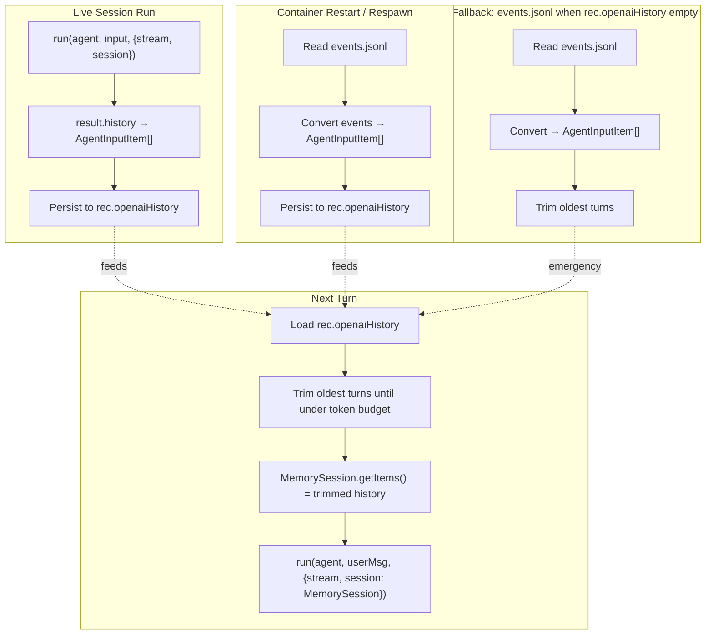

# Completions-Only Chat History Context — Design Spec

**Date:** 2026-06-03
**Feature:** OpenAI SDK path: Completions API only, client-side chat history context
**Branch target:** `openai_agent_sdk`
**Approach:** Build messages[] from events.jsonl (Approach C)

---

## Goal

Two changes to the OpenAI SDK path:

1. **Remove all Responses API functionality** — the OpenAI SDK path now aims to be Completions API only, regardless of base URL. No `previousResponseId`, no `setDefaultOpenAIClient` (which defaults to Responses), no Responses-specific event handling.

2. **Add client-side chat history context management** — since Completions API has no server-managed conversation state, the client must construct and pass the full `messages[]` history on each turn. The source for this history is `events.jsonl` (the per-session event log already persisted under `_myco_/`).

**Constraint:** Reuse readily available code. The `@openai/agents` SDK already provides `result.history` (the `AgentInputItem[]` from a completed run) which can be passed as `input` to the next `run()` call. The SDK also provides `MemorySession` for automatic history accumulation. We should use these SDK facilities rather than building our own messages[] assembler from scratch.

---

## Design Decisions

| Decision | Choice | Rationale |
|---|---|---|
| API mode | Always `useResponses: false` | Completions API only, no Responses API ever. Works with any OpenAI-compatible endpoint. |
| Conversation context source | `result.history` (SDK-native) + events.jsonl fallback | Primary: SDK's `result.history` gives exact `AgentInputItem[]` with tool calls/results — no conversion needed. Fallback: events.jsonl for cross-restart history reconstruction when `result.history` is not available (container restart, 5-min reaper kill). |
| History persistence | `AgentInputItem[]` serialized to `rec.openaiHistory` in sessions.json | Survives container restart. Rehydrated on session respawn. This replaces `rec.openaiResponseId`. |
| Truncation strategy | Token-count heuristic (4 chars/token), configurable max, trim oldest turns | User-specified. A "turn" = user message → assistant response (including interleaved tool calls/results), ending before the next user message. Trim turns from the tail end until estimated token count is under the limit. |
| turn_start prompt truncation | Remove the 200-char cap for the OpenAI path | Currently `turn_start.prompt` is truncated to 200 chars, making it useless for history reconstruction. Store the full prompt instead. |
| SDK configuration | `OpenAIProvider({ useResponses: false })` everywhere | Eliminates the dual-branch pattern (setDefaultOpenAIClient vs OpenAIProvider). Single code path regardless of base URL. |
| History assembly | SDK `MemorySession` for live runs; manual `AgentInputItem[]` from events.jsonl for respawn | `MemorySession` auto-accumulates history during a live session. On respawn (after restart), we rehydrate from `rec.openaiHistory` into a `MemorySession`. |

---

## 1. Responses API Removal

### What to remove

| Location | What | Lines (approx) |
|---|---|---|
| `agent-session.js` | `this.openaiResponseId` field | 243 |
| `agent-session.js` | `previousResponseId` in `runOpts` | 700-702 |
| `agent-session.js` | `this.openaiResponseId = result.lastResponseId` | 720 |
| `agent-session.js` | `this._persistOpenaiResponseId()` call | 721 |
| `agent-session.js` | `_persistOpenaiResponseId()` method | 779-791 |
| `agent-session.js` | 404 resume-failure block (`isResumeFailure`) | 750-756 |
| `agent-session.js` | `openaiResponseId` persist in `_handleEvent` Claude path | 1123-1126 |
| `sessions.js` | `resumeOpenaiResponseId` spawn option | 1052 |
| `test.sh` | Static check for `_persistOpenaiResponseId` | 1666-1669 |
| `temp.py` | Entire file (Responses API test with hardcoded key) | entire |
| `test/agent-session-openai.test.js` | `lastResponseId` / `previousResponseId` test | 41-49 |

### What to replace (Responses → Completions)

| Location | Current | Replacement |
|---|---|---|
| `agent-session.js` 658-668 | Dual-branch: `setDefaultOpenAIClient(new OpenAI({ apiKey }))` for default OpenAI; `OpenAIProvider({ useResponses: false })` for custom baseURL | Single path: always `setDefaultModelProvider(new OpenAIProvider({ apiKey, baseURL: baseUrl, useResponses: false }))` — no if/else branching |
| `agent-session.js` 654 | Import `setDefaultOpenAIClient` | Remove it; import only `Agent, run, OpenAIProvider, setDefaultModelProvider` |
| `agent-session.js` 822 | `data.type === 'response.output_text.delta'` | In Completions mode, raw model events have `data.type === 'output_text_delta'` (normalized by SDK converter). Replace the raw handler to check for `output_text_delta` instead, or remove it entirely since `message_output_created` already captures the full text output |
| `btw.js` 113, 123 | Import + use `setDefaultOpenAIClient(new OpenAI({ apiKey }))` | Replace with `setDefaultModelProvider(new OpenAIProvider({ apiKey, useResponses: false }))` |
| `claude-cli.js` 75, 88 | Same as btw.js | Same replacement |
| `test/agent-session-openai.test.js` 13, 29 | Import + use `setDefaultOpenAIClient` | Replace with `OpenAIProvider, setDefaultModelProvider`; use `setDefaultModelProvider(new OpenAIProvider({ apiKey, useResponses: false }))` |
| `test/adapt-openai-event.test.js` | `response.output_text.delta` mock | Update for Completions-mode event shape |

### What stays (unchanged)

| Item | Reason |
|---|---|
| `_adaptOpenAIEvent()` method body (except raw handler) | SDK-normalized event names work identically in Completions mode |
| `_ocRunState` / `_pendingOCApprovals` / `_handleOCInterruptions()` | Interruption/resume cycle works identically in Completions mode |
| `_isRecoverableOC()` / `_emitRetryAndWaitOC()` | Generic error recovery |
| `callOpenAICompatible()` in `anthropic.js` | Already uses Chat Completions (raw fetch) |
| `useResponses: false` on custom baseURL branches | Already correct — now applied universally |
| `oc-tools/` + `openai-tools/` | Pure tool execution, no API mode dependency |

---

## 2. Client-Side Chat History Context

### Architecture



### Primary path: SDK `result.history` + `MemorySession`

The `@openai/agents` SDK provides two facilities for Completions-mode history:

1. **`result.history`** — after a `run()` completes, the `RunResult` / `StreamedRunResult` carries `.history`: an `AgentInputItem[]` containing the full conversation (user messages, assistant messages, tool calls, tool results, reasoning items). This is the exact format the SDK needs as `input` for the next turn.

2. **`MemorySession`** — a session object that auto-accumulates `AgentInputItem[]` across multiple `run()` calls within the same JS process. When passed as `run(agent, input, { session })`, the runner prepends `session.getItems()` before each model call.

**Live session strategy:**

- On session spawn, create a `MemorySession` instance.
- If `rec.openaiHistory` exists (from prior process), load it into the session via `session.setItems(deserializedHistory)`.
- Pass `session` as a `run()` option on every iteration.
- After each successful `run()`, persist `result.history` (or `session.getItems()`) to `rec.openaiHistory` in sessions.json.
- On the next `run()`, the session automatically provides the accumulated history.

**Why this is better than building messages[] ourselves:**

- `result.history` contains the exact `AgentInputItem[]` format — no conversion needed. The SDK's internal `itemsToMessages()` converter handles the transformation to Chat Completions `messages[]`.
- Tool calls and tool results are already in the correct SDK protocol format (function_call / function_call_result items).
- No risk of format mismatches between our manual assembly and what the SDK expects.

### Fallback path: events.jsonl → AgentInputItem[]

When `rec.openaiHistory` is empty (fresh session, corrupted data, or first run after a feature migration), we reconstruct history from `events.jsonl`.

**Event → AgentInputItem mapping:**

| Event type | AgentInputItem shape | Notes |
|---|---|---|
| `turn_start` (with full `prompt`) | `{ type: 'message', role: 'user', content: prompt }` | Requires removing the 200-char truncation cap |
| `assistant_text` (accumulated per turn) | `{ type: 'message', role: 'assistant', content: [text parts] }` | Multiple `assistant_text` events per turn must be concatenated. Dedup against `turn_result.text` |
| `tool_use` | `{ type: 'function_call', name, call_id, arguments }` | `arguments` must be `JSON.stringify(input)` |
| `tool_result` | `{ type: 'function_call_result', call_id, output }` | `output` is the tool result content string |
| `reasoning_text` | `{ type: 'reasoning', summary: [{ type: 'summary_text', text }] }` | Only for o-series models |
| `turn_result` | Dedup/fallback for `assistant_text` | Use `turn_result.text` when no `assistant_text` events exist for a turn |

**Assembly algorithm:**

```
1. Read events.jsonl (from this.buffer in-memory, or from disk file)
2. Group events by turn boundaries:
   - A turn starts at a turn_start event
   - A turn ends at the next turn_start, or at the end of the event stream
3. Within each turn, collect:
   - user message from turn_start.prompt
   - assistant text from assistant_text events (concatenate deltas)
   - tool calls from tool_use events
   - tool results from tool_result events
   - reasoning from reasoning_text events
4. Convert each turn into AgentInputItem[]:
   - If tool calls exist: one assistant message with function_call items,
     followed by function_call_result items for each result
   - If only text: one assistant message with output_text content
5. Trim oldest turns until estimated token count < MAX_CONTEXT_TOKENS
   - Estimate: total chars / 4 (rough chars-per-token heuristic)
   - Configurable: MYCO_CONTEXT_MAX_TOKENS env var (default: 32000)
```

### History persistence: `rec.openaiHistory`

**New field in `sessions.json` session records:**

```json
{
  "sessionId": "...",
  "openaiHistory": [
    { "type": "message", "role": "user", "content": "Fix the login bug" },
    { "type": "message", "role": "assistant", "content": [{ "type": "output_text", "text": "I'll look at the login code..." }] },
    { "type": "function_call", "name": "bash", "call_id": "call_abc123", "arguments": "{\"command\":\"grep -r login\"}" },
    { "type": "function_call_result", "call_id": "call_abc123", "output": "..." },
    { "type": "message", "role": "assistant", "content": [{ "type": "output_text", "text": "The bug is in auth.js..." }] }
  ]
}
```

This replaces `rec.openaiResponseId` (which stored a single string). The `AgentInputItem[]` format is JSON-serializable and can grow large — we impose a byte budget on what we persist (trim to the most recent turns that fit within `MAX_CONTEXT_TOKENS * 4` chars).

**Persistence timing:**

- After each successful `run()`: serialize `session.getItems()` (or `result.history`) and write to `rec.openaiHistory`.
- After trimming: write the trimmed version (not the full history) so sessions.json doesn't grow unbounded.

### `turn_start` prompt truncation fix

Currently: `this._emit({ type: 'turn_start', prompt: trimmed.slice(0, 200) })`

Change: `this._emit({ type: 'turn_start', prompt: trimmed })` — store the full user message in events.jsonl.

The 200-char truncation was purely for display (the chat pane's turn-start chrome card). The chat pane already receives the full user message via the `chat` WS frame (from `appendChatMessage`), so the truncated `turn_start` event was never the display source. Removing the cap doesn't change the UI — it only makes events.jsonl usable for history reconstruction.

---

## 3. Changes to `_ensureIterationOpenAI()`

### Before (Responses API path):

```js
async _ensureIterationOpenAI() {
  // ...
  // Dual-branch provider setup:
  if (baseUrl && baseUrl !== 'https://api.openai.com/v1') {
    const provider = new OpenAIProvider({ baseURL: baseUrl, apiKey, useResponses: false });
    setDefaultModelProvider(provider);
  } else {
    const client = new OpenAI({ apiKey });
    setDefaultOpenAIClient(client);  // ← defaults to Responses API
  }

  // Conversation continuation via previousResponseId:
  if (this.openaiResponseId && !this._ocRunState) {
    runOpts.previousResponseId = this.openaiResponseId;
  }

  // Run:
  let result = await run(agent, input, runOpts);

  // Store response ID:
  this.openaiResponseId = result.lastResponseId;
  this._persistOpenaiResponseId();
}
```

### After (Completions API path):

```js
async _ensureIterationOpenAI() {
  // ...
  // Single provider path — always Completions mode:
  const providerOpts = { apiKey, useResponses: false };
  if (baseUrl) providerOpts.baseURL = baseUrl;
  setDefaultModelProvider(new OpenAIProvider(providerOpts));

  // Create MemorySession, load history from rec.openaiHistory:
  if (!this._openaiSession) {
    const { MemorySession } = require('@openai/agents');
    this._openaiSession = new MemorySession();
    if (this._openaiHistoryItems && this._openaiHistoryItems.length > 0) {
      this._openaiSession.setItems(this._openaiHistoryItems);
    }
  }

  // Run with session for auto-history:
  let result = await run(agent, input, {
    stream: true,
    signal: this._abortController.signal,
    maxTurns: null,
    session: this._openaiSession,
  });

  // Persist history after success:
  this._persistOpenaiHistory();
}
```

**Key changes:**
- No `previousResponseId` — removed entirely
- `session: this._openaiSession` — the SDK accumulates history automatically
- `_persistOpenaiHistory()` — new method that serializes session items to `rec.openaiHistory`
- On `_ocRunState` resume (after interruption), the session continues from where it left off — no need for `previousResponseId`

---

## 4. History Trimming Strategy

**Configuration:**

| Env var | Default | Purpose |
|---|---|---|
| `MYCO_CONTEXT_MAX_TOKENS` | `32000` | Maximum estimated token count for history context |

**Trimming algorithm:**

```
function trimHistoryToBudget(items, maxTokens) {
  const maxChars = maxTokens * 4;  // 4 chars per token heuristic
  const turns = splitIntoTurns(items);  // group by user→assistant boundaries

  // Calculate total chars
  let totalChars = estimateChars(items);
  if (totalChars <= maxChars) return items;

  // Trim oldest turns until under budget
  let kept = turns;
  while (kept.length > 1 && estimateChars(kept) > maxChars) {
    kept = kept.slice(1);  // drop oldest turn
  }

  return flattenTurns(kept);
}
```

**Turn boundary definition:** A "turn" = user message → all subsequent assistant messages, tool calls, and tool results → up to (but not including) the next user message. This preserves the conversation structure needed by the Completions API (tool results must follow their corresponding tool calls).

**When trimming runs:**
- Before persisting to `rec.openaiHistory` — so the stored history stays bounded
- On respawn when loading history into `MemorySession` — so the context doesn't exceed the model's window
- Not during a live run — the `MemorySession` accumulates naturally; trimming happens only at persist/respawn boundaries

---

## 5. Respawn / Cross-Restart History Recovery

When the server restarts (deploy, crash, 5-min reaper kill), the in-memory `MemorySession` is lost. Recovery flow:

```
1. sessions.js ensureLive() reads rec.openaiHistory
2. If rec.openaiHistory exists and non-empty:
   - Deserialize into AgentInputItem[]
   - Trim to budget
   - Pass as resumeOpenaiHistory: items to spawnAgent()
3. If rec.openaiHistory is empty/missing (migration case):
   - Read events.jsonl from disk
   - Convert events → AgentInputItem[] via _reconstructHistoryFromEvents()
   - Trim to budget
   - Pass as resumeOpenaiHistory: items to spawnAgent()
4. AgentSession constructor loads items into MemorySession
```

**New spawn option:**

```js
// sessions.js ensureLive():
const session = spawnAgent(sessionId, {
  cwd: rec.absCwd,
  resumeSdkSessionId: rec.sdkSessionId || null,
  resumeOpenaiHistory: rec.openaiHistory || null,  // replaces resumeOpenaiResponseId
  user: rec.user || null,
});
```

**`_reconstructHistoryFromEvents()` — new method:**

Reads `this.buffer` (in-memory) or the `_myco_/events.jsonl` file, groups events by turn boundaries, and converts to `AgentInputItem[]`. Only processes events relevant for context: `turn_start`, `assistant_text`, `tool_use`, `tool_result`, `reasoning_text`, `turn_result`. Skips lifecycle events (`session_ready`, `iteration_start`, `permission_request`, etc.).

---

## 6. Changes to `_adaptOpenAIEvent()`

In Completions mode, the SDK's converter produces the same normalized event names (`message_output_created`, `tool_called`, `tool_output`, `reasoning_item_created`). The `raw_model_stream_event` handler must be updated:

**Before (Responses API):**
```js
if (event.type === 'raw_model_stream_event') {
  const data = event.data;
  if (data && data.type === 'response.output_text.delta' && data.delta) {
    this._emit({ type: 'assistant_text', text: data.delta, providerId: 'openai' });
    this._persistAssistantTextToRecChat(data.delta);
  }
  return;
}
```

**After (Completions API):**

In Completions mode, streaming text deltas arrive via the SDK's normalized `output_text_delta` event which the runner converts to `message_output_created`. The `raw_model_stream_event` with `data.type === 'model'` carries the raw Chat Completions chunk — not useful for text extraction.

Two options:

**Option A (simpler, recommended):** Remove the `raw_model_stream_event` handler entirely. The `run_item_stream_event` with `name === 'message_output_created'` already captures the complete text output. This means we lose streaming deltas (the text only appears when the full message is complete) — but the `message_output_created` event fires when the assistant message finishes, which is still responsive enough for the chat pane.

**Option B (preserve streaming):** Check for the Completions-mode delta type. The SDK converter produces `output_text_delta` events in the normalized protocol stream. In `_adaptOpenAIEvent`, handle `event.type === 'raw_model_stream_event'` with `data.type === 'output_text_delta'` to emit streaming text deltas.

Recommendation: **Option A** for the initial implementation. The `message_output_created` event provides the complete text and is simpler. If streaming latency is a problem, we can add Option B later.

---

## 7. Error Handling Changes

### Removed: 404 resume-failure handling

The Responses API path handled 404 errors when `previousResponseId` referenced an expired conversation. In Completions mode, there is no server-side conversation ID — the history is local. Remove the entire `isResumeFailure` block.

### Added: Context overflow handling

The Completions API returns a 400 error when the `messages[]` exceeds the model's context window. Handle this by:

```
1. If err.status === 400 && err.code === 'max_context_length_exceeded':
   - Trim rec.openaiHistory more aggressively (e.g., halve the token budget)
   - Clear the MemorySession and reload with trimmed history
   - Retry the current turn with reduced context
   - If retry also fails: emit fatal error
```

This replaces the 404 resume-failure recovery with a context-overflow recovery.

---

## 8. Files Changed

### New files

| File | Purpose |
|---|---|
| `server/src/chat-history-openai.js` | History trimming, events.jsonl → AgentInputItem[] conversion, budget calculation. Pure functions, no SDK dependency for the conversion logic. |

### Modified files

| File | Change |
|---|---|
| `server/src/agent-session.js` | Remove `openaiResponseId` field, `_persistOpenaiResponseId()`, `previousResponseId` logic, 404 resume-failure handler, `setDefaultOpenAIClient` import/usage. Add `_openaiSession` (MemorySession), `_openaiHistoryItems` (loaded from rec), `_persistOpenaiHistory()`, `_reconstructHistoryFromEvents()`. Change provider setup to always `OpenAIProvider({ useResponses: false })`. Change `_adaptOpenAIEvent()` raw handler. Remove 200-char truncation on `turn_start`. |
| `server/src/sessions.js` | Replace `resumeOpenaiResponseId` with `resumeOpenaiHistory` in spawn options. Add `rec.openaiHistory` field handling. |
| `server/src/btw.js` | Replace `setDefaultOpenAIClient` with `setDefaultModelProvider(OpenAIProvider({ useResponses: false }))` everywhere. |
| `server/src/claude-cli.js` | Same as btw.js. |
| `server/src/index.js` | Add `MYCO_CONTEXT_MAX_TOKENS` to `ENV_KEYS`. |
| `test/test.sh` | Remove static check for `_persistOpenaiResponseId`. Add check for `_openaiSession`, `_persistOpenaiHistory`, `chat-history-openai.js`. |
| `test/agent-session-openai.test.js` | Remove `lastResponseId` / `previousResponseId` test. Replace `setDefaultOpenAIClient` with `OpenAIProvider`. Add test for `MemorySession`-based history accumulation. |
| `test/adapt-openai-event.test.js` | Remove `response.output_text.delta` mock. Update for Completions-mode events. |

### Deleted files

| File | Reason |
|---|---|
| `temp.py` | One-off Responses API test with hardcoded key |

---

## 9. Testing Strategy

### Unit tests

| Test file | What it tests |
|---|---|
| `test/chat-history-openai.test.js` (new) | `trimHistoryToBudget()` — trimming logic with various turn counts and budgets. `_reconstructHistoryFromEvents()` — event grouping, turn boundary detection, AgentInputItem[] assembly. Token estimation heuristic. |
| `test/agent-config.test.js` (existing) | `MYCO_CONTEXT_MAX_TOKENS` env var is recognized. |
| `test/agent-session-openai.test.js` (modified) | History accumulation via `MemorySession`. History persistence to `rec.openaiHistory`. Respawn with history rehydration. Context overflow recovery. |

### Static checks in `test.sh`

- `chat-history-openai.js` exports `trimHistoryToBudget`, `_reconstructHistoryFromEvents`
- `agent-session.js` has `_openaiSession` field, `_persistOpenaiHistory` method
- `agent-session.js` does NOT reference `openaiResponseId`, `_persistOpenaiResponseId`, `previousResponseId`, `setDefaultOpenAIClient`
- `sessions.js` references `openaiHistory` (not `openaiResponseId`)
- No hardcoded `api.openai.com` URLs outside `agent-config.js` defaults

### Integration smoke test

- Spawn OpenAI session, send message, verify `assistant_text` and `turn_result`
- Verify `rec.openaiHistory` populated after first turn
- Verify second turn uses accumulated history (agent remembers previous context)
- Verify respawn loads history from `rec.openaiHistory`

---

## 10. Migration Path

For existing sessions that have `rec.openaiResponseId` but no `rec.openaiHistory`:

1. On first respawn after this feature ships, `ensureLive()` detects `rec.openaiResponseId` is present but `rec.openaiHistory` is empty.
2. It reads the session's `events.jsonl` and reconstructs `AgentInputItem[]` via `_reconstructHistoryFromEvents()`.
3. Writes the result to `rec.openaiHistory` and clears `rec.openaiResponseId`.
4. Proceeds with normal `MemorySession`-based history.

This is a one-time migration per session. After it runs, `rec.openaiResponseId` is gone and `rec.openaiHistory` is the canonical history source.

---

## 11. Out of Scope

- Streaming text deltas in Completions mode (Option B from §6) — deferred to a follow-up if latency is a problem
- Cross-provider history sharing (Anthropic sessions can't use `AgentInputItem[]`)
- `rec.openaiHistory` compression (JSON can be large; compression is a future optimization)
- Custom `Session` implementations beyond `MemorySession`
- Anthropic path changes (this spec only affects the OpenAI path)