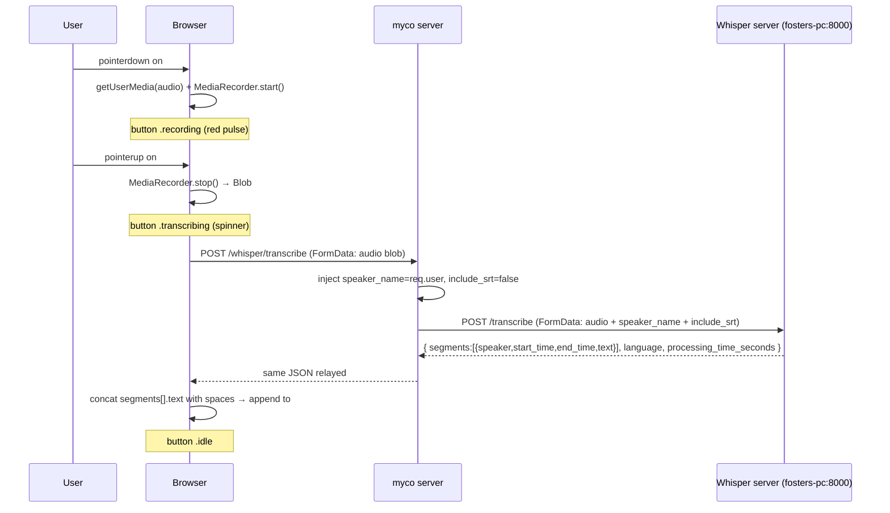

# Voice Input Button — Design Spec (Task 1)

**Date:** 2026-06-17
**Status:** Approved (pending spec review)
**Scope:** Task 1 of a 3-task voice integration. Tasks 2 (upload meeting) and 3 (unknown-speaker prompt) are out of scope and will be specced separately.

## Goal

Enable the existing disabled `#chat-mic` button in the chat composer. When pressed and held, record audio from the device microphone. On release, send the audio to the whisper-diarization server's "known-speaker" mode (Mode 3), receive the transcript, and append the transcript text into the chat composer textarea (`#chat-input`) for the user to review and send.

## Verified external dependencies

- **Whisper server**: alive at `http://fosters-pc:8000/health` and `http://100.106.15.86:8000/health` (Tailscale). GPU (cuda), all models loaded (whisper + alignment + punct + diarizer + speaker_persistence all `true`).
- **API**: `POST /transcribe` accepts `multipart/form-data` with an `audio` file field. Mode 3 (known-speaker) is triggered by passing `speaker_name=<id>` as a form field. Response shape:
  ```json
  {
    "segments": [{"speaker": "...", "start_time": 320, "end_time": 3180, "text": "..."}],
    "srt": null,
    "language": "en",
    "processing_time_seconds": 2.84
  }
  ```
  - `start_time`/`end_time` are in **milliseconds** (irrelevant for task 1 — we only use `text`).
  - `speaker` is the `speaker_name` we passed (every segment gets this label in Mode 3).
- **No CORS** on the whisper server — the browser cannot fetch it directly. Must proxy through myco.
- **No auth** on the whisper server — the myco proxy provides the auth boundary.
- **No `force` parameter on `/transcribe`**. Mode 3 auto-handles new vs. known speakers: first call creates the profile, subsequent calls update the embedding via running average. (`force=true` exists only on `POST /speakers/{name}/rename` for merging profiles — not relevant here.)
- **Audio format**: server accepts any ffmpeg-decodable format; non-WAV/FLAC is converted to 16kHz mono WAV internally. WebM/Opus is the optimal browser format (~10x smaller than WAV, no quality loss for speech).

## Architecture

### New server route: `POST /whisper/transcribe`

Location: `server/src/index.js` (register near the other authenticated routes).

Authenticated via myco's existing bearer-token middleware (same as all other myco routes). The authenticated user's login becomes the `speaker_name` injected into the whisper request — the client never sends `speaker_name`, so it cannot be spoofed.

**Request** (from browser): `multipart/form-data` with a single `audio` file field (the recorded Blob).

**Server behavior:**
1. Read `WHISPER_SERVER_URL` from `process.env`. If unset → `503 {"detail":"Whisper server not configured"}`.
2. Parse the incoming `audio` file via `multer` (new dependency — see below).
3. Build an outbound `FormData`:
   - `audio`: `new Blob([buffer], { type: mimetype })`, filename preserved
   - `speaker_name`: `req.user` (the authenticated myco login)
   - `include_srt`: `'false'` (we only need segment text, not subtitles)
4. `fetch(`${WHISPER_SERVER_URL}/transcribe`, { method: 'POST', body: outboundFormData })`
5. Relay the JSON response back to the client (status code + body).
6. On whisper error (non-2xx): relay whisper's `{detail}` with the same status code.

**Why `multer`:** myco has no multipart parser today (no multer/busboy/formidable in `server/package.json`). `multer` is the standard Express multipart middleware (~150KB, wraps busboy). Alternative: Node 20's built-in `Request.formData()` via `Readable.toWeb(req)` — no new dependency but finicky Express-req-to-Web-stream conversion. Recommend `multer` for clarity.

### Env var: `WHISPER_SERVER_URL`

Added to `$MYCO_STATE_DIR/.env` alongside existing `MYCO_GH_*` / `MYCO_PUBLIC_ORIGIN` vars. Read once at boot via the existing dotenv config path.

Example:
```
WHISPER_SERVER_URL=http://fosters-pc:8000
```

Exposed to the client via a new `whisperConfigured: bool` field on the `/auth/check` response (`server/src/index.js:243-248`):
```js
return res.json({
  ok: true, required: isAuthRequired(),
  user: profile.login,
  name: profile.name || null,
  avatar_url: profile.avatarUrl || null,
  whisperConfigured: !!process.env.WHISPER_SERVER_URL,
});
```

No server-side health probe of the whisper server — the client learns availability by trying to transcribe (avoids coupling attach latency to whisper uptime).

### Button visibility

On attach, the client reads `whisperConfigured` from `/auth/check`. If `true`, unhide + enable `#chat-mic`. If `false`, keep current `hidden disabled` state (the button is invisible — no confusing disabled affordance).

## Components

### Server (`server/src/`)

| File | Change |
|------|--------|
| `index.js` | New `POST /whisper/transcribe` route (~40 lines). Uses `multer` for single-file `audio` field. Builds outbound `FormData`, `fetch()`-es whisper, relays JSON. |
| `index.js:243-248` | Add `whisperConfigured: !!process.env.WHISPER_SERVER_URL` to the `/auth/check` authenticated response. |
| `package.json` | Add `multer` dependency. |

### Client (`web/public/`)

| File | Change |
|------|--------|
| `app.js` | New `_bindVoiceInput()` function. Wires `#chat-mic` via Pointer Events. State machine: `idle → recording → transcribing → idle`. Manages `MediaRecorder`, builds Blob, POSTs to `/whisper/transcribe`, parses response, appends text to `#chat-input`. Called from the existing `bindChatUi()` or equivalent init path. |
| `app.js` | On `/auth/check` response, read `whisperConfigured` and toggle `#chat-mic` `hidden`/`disabled`. |
| `index.html:188-191` | Remove `hidden` and `disabled` attributes from `#chat-mic` (JS manages these states based on `whisperConfigured`). |
| `styles.css` | `.composer-btn-mic.recording` (red, pulsing animation), `.composer-btn-mic.transcribing` (spinner, disabled). |

### Recording state machine

```
idle ──pointerdown──▶ recording ──pointerup (window, not cancelled)──▶ transcribing ──200 OK──▶ idle
                          │                                                    │
                          │                                                    └──error──▶ idle (+ toast)
                          │
                          └──pointerleave/pointercancel──▶ idle (discard, no toast)
                          └──< 200ms duration──▶ idle (silent cancel)
```

**`pointerdown` (start recording):**
1. `navigator.mediaDevices.getUserMedia({ audio: true, video: false })`
2. If rejected → toast "Microphone access denied — check browser permissions", stay `idle`.
3. Pick mimeType: first supported from `['audio/webm;codecs=opus', 'audio/webm', 'audio/mp4']` via `MediaRecorder.isTypeSupported()`.
4. `new MediaRecorder(stream, { mimeType, audioBitsPerSecond: 64000 })` (64kbps is sufficient for speech).
5. `recorder.start()` + record start timestamp.
6. Add `.recording` class to button (red pulse).

**`pointerup` on button (stop + send):**
1. `recorder.stop()` → `ondataavailable` → collect chunks → `new Blob(chunks, { type: mimeType })`.
2. Stop all `MediaStream` tracks (mic light off).
3. If `Date.now() - startTs < 200` → silent cancel, return to `idle`.
4. Add `.transcribing` class (spinner, disable button).
5. Build `FormData`: `audio` = blob with filename `voice.webm` (or `.mp4`).
6. `fetch('/whisper/transcribe', { method: 'POST', body: formData })`.
7. On `200`: parse `segments`, concat `segments[].text` with spaces, append to `#chat-input` (leading space if textarea non-empty), return to `idle`.
8. On error: toast (see error table), return to `idle`.

**`pointerleave`/`pointercancel` during recording:**
1. `recorder.stop()` + stop tracks.
2. Discard blob (do not send).
3. Return to `idle`. No toast.

**Pointer Events vs. mouse/touch:** Use Pointer Events (`pointerdown`, `pointerleave`, `pointercancel`) on the button + `pointerup` on `window` for unified mouse + touch handling. Do NOT use `setPointerCapture` — it would suppress `pointerleave` (captured pointers don't emit leave events), breaking the cancel-on-leave gesture. Instead:

- `pointerdown` on button → start recording. Attach a `pointerup` listener on `window`. Set `cancelled = false`.
- `pointerleave` / `pointercancel` on button → set `cancelled = true`, cancel recording + discard.
- `pointerup` on `window` → if `cancelled`, no-op (already handled by leave); else stop + send. Remove the `window.pointerup` listener.

This guarantees: release-on-button → send; slide-off-then-release → cancel (leave fires before up); OS-cancelled touch → cancel. The `cancelled` flag prevents the double-fire race (leave then up) from both discarding AND sending.

## Data flow



## Audio format

Browser picks the first supported mimeType from:
1. `audio/webm;codecs=opus` — Chrome/Firefox default. ~10x smaller than WAV, speech-optimized.
2. `audio/webm` — fallback if codecs param unsupported.
3. `audio/mp4` — Safari (doesn't support WebM).

Filename extension matches container: `.webm` or `.mp4`.

Bitrate: `audioBitsPerSecond: 64000` — sufficient for speech, keeps short recordings under 100KB.

The whisper server converts to 16kHz mono WAV internally via ffmpeg regardless of input format, so we send the smallest format that preserves speech. WebM/Opus at 64kbps is strictly better for upload bandwidth than raw WAV with no transcription-quality loss.

## Error handling

| Error | Detection | UX |
|-------|-----------|-----|
| Mic permission denied | `getUserMedia` rejects | Toast: "Microphone access denied — check browser permissions"; button → `idle` |
| Recording < 200ms | `Date.now() - startTs < 200` | Silent cancel, button → `idle`, no toast |
| Pointer left button during recording | `pointerleave` / `pointercancel` | Cancel + discard audio, button → `idle`, no toast |
| `WHISPER_SERVER_URL` unset | `503` from myco proxy | Toast: "Transcription service not configured"; hide button |
| Whisper unreachable / network error | `fetch` rejects or non-2xx | Toast: "Transcription service unavailable" |
| Whisper returns `400`/`500` | HTTP status on response | Toast: "Transcription failed: \<detail\>" |
| Empty transcript (`segments: []` or all empty text) | Response shape check | Toast: "No speech detected" |
| `MediaRecorder` error | `onerror` callback | Toast: "Recording failed" |

**Invariant:** on every exit path (success, cancel, or error), the `MediaStream` tracks are stopped (mic indicator light off) and the button returns to `idle`. No audio is inserted into the textarea on error.

**Toast mechanism:** reuse myco's existing toast/notification surface (check `app.js` for an existing `toast()` or notification helper; if none exists, use a simple transient `<div>` near the composer).

## Testing

Following myco's `./test/test.sh` conventions (static checks + server smoke + regression guards):

1. **`test_whisper_proxy_route_exists`** (static) — grep `server/src/index.js` for `/whisper/transcribe` route registration.
2. **`test_mic_button_conditional_unhide`** (static) — grep `app.js` for `whisperConfigured` gating the `#chat-mic` `hidden` attribute.
3. **`test_speaker_name_injected_server_side`** (static + regression) — grep `index.js` confirms `speaker_name` is set from the authenticated user (e.g. `req.user` or `profile.login`), NOT from `req.body` / form data. Prevents spoofing regression.
4. **`test_whisper_proxy_503_when_unconfigured`** (server smoke) — boot a smoke myco server without `WHISPER_SERVER_URL` set; `POST /whisper/transcribe` returns `503`. (Reuse `start_smoke_server` from `test.sh`.)
5. **`test_whisper_proxy_relays_when_configured`** (server smoke) — boot a mock whisper server on a free port (return canned `{"segments":[{"speaker":"x","start_time":0,"end_time":1000,"text":"hello"}],"srt":null,"language":"en","processing_time_seconds":0.1}`); set `WHISPER_SERVER_URL` to it; `POST /whisper/transcribe` with a small audio blob returns `200` + the canned JSON.
6. **`test_mic_audiotype_preference`** (static) — grep `app.js` confirms the mimeType preference list has `audio/webm;codecs=opus` first.
7. **`test_auth_check_exposes_whisper_configured`** (server smoke) — `/auth/check` response includes `whisperConfigured: bool`.

All tests must run sub-second standalone, use `free_port` for any port, and `mktemp -d` for any tmp directory (per myco test conventions §10c).

## Out of scope (tasks 2 & 3)

- "Upload meeting" button + meeting diarization (Mode 2) — task 2.
- Collapsible batch chat bubbles for meeting transcripts — task 2.
- Unknown-speaker prompt window (permission-modal-style) — task 3.
- OpenAI-compatible API path — user said stub for task 2.
- Server-side health probe of whisper on attach (deferred — button-visibility is based on env-var config only).
- Admin config modal for `WHISPER_SERVER_URL` (env-var-only for task 1; can add later if needed).
