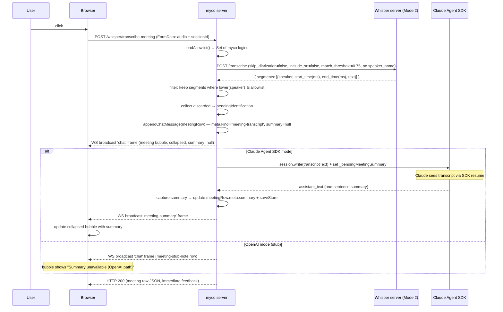

# Upload Meeting Button — Design Spec (Task 2)

**Date:** 2026-06-18
**Status:** Approved (pending spec review)
**Scope:** Task 2 of a 3-task voice integration. Task 1 (voice input button)
shipped (commits after `b6fd832`). Task 3 (unknown-speaker prompt window) is
out of scope and will be specced separately — this design stubs task 3 by
storing `meta.pendingIdentification` on the meeting chat row without surfacing
it in the UI.

## Goal

Add an "Upload meeting" button to the chat composer. The user picks an audio
file (wav/mp3/m4a/ogg/flac/etc.). The server proxies the file to the
whisper-diarization server's "meeting diarization" mode (Mode 2), receives
diarized segments labelled by speaker, filters to keep only the segments
spoken by **known myco users** (logins in `allowed-github-users.txt`), and
discards everything else. The kept transcript is:

1. Persisted as a **collapsible chat bubble** in `rec.chat` (collapsed by
   default; expands on click to show the full transcript with speaker labels
   + timestamps).
2. Sent to Claude as a **synthetic user turn** via `session.write()` so it
   enters Claude's SDK conversation transcript (the SDK's `resume` mechanism
   is the only channel Claude uses for prior context — `rec.chat` alone is
   invisible to Claude).
3. Summarised by Claude into **one sentence** that is captured back into the
   collapsed bubble's header (the synthetic turn asks Claude for the summary
   as its response).

The OpenAI-compatible API path is **stubbed**: upload + diarize + persist
works (mode-agnostic), but the Claude-context injection (`session.write`) and
summary generation are skipped. The meeting bubble is stored with
`meta.summary: null` in OpenAI-mode sessions.

## Verified external dependencies

- **Whisper server**: alive at `http://fosters-pc:8000/health` and
  `http://100.106.15.86:8000/health` (Tailscale). GPU (cuda), all models
  loaded (whisper + alignment + punct + diarizer + speaker_persistence all
  `true`).
- **API**: `POST /transcribe` accepts `multipart/form-data` with an `audio`
  file field. Mode 2 (meeting diarization) is triggered by passing
  `skip_diarization=false` and OMITTING `speaker_name`. Response shape:
  ```json
  {
    "segments": [
      {"speaker": "alice", "start_time": 5000, "end_time": 11000, "text": "Hello."},
      {"speaker": "Speaker 0", "start_time": 12000, "end_time": 18000, "text": "Hi."}
    ],
    "srt": null,
    "language": "en",
    "processing_time_seconds": 12.34
  }
  ```
  - `start_time`/`end_time` are in **milliseconds** (float-typed but integer
    values). Divide by 1000 for seconds.
  - `speaker` is either a matched known name (a previously-registered speaker
    profile, e.g. a myco login from task 1's Mode 3 calls) OR an auto-label
    `Speaker N` (regex `^Speaker \d+$`) for unmatched voices.
- **`match_threshold`**: whisper server defaults to `0.75` (the
  `BRANCH_CONTEXT.md` says 0.6 — that's the floor in `speaker_store`, not the
  server default). Pin it explicitly in the outbound form to `0.75` so the
  cutoff is deterministic.
- **No CORS** on the whisper server — must proxy through myco (same as task 1).
- **No auth** on the whisper server — myco's proxy provides the auth boundary.
- **No upload size limit** on the whisper server, but the entire upload is
  buffered into RAM (`server.py:374 audio.file.read()`). myco's multer limit
  is the practical cap.
- **Audio format**: server accepts any ffmpeg-decodable format; non-WAV/FLAC
  is converted to 16kHz mono WAV internally via ffmpeg. We send the user's
  original file as-is (no client-side conversion).
- **Speaker management REST** (for task 3, not used in task 2):
  `POST /speakers/{name}/rename` with `{new_name, force?}` will be used by
  task 3 to identify `Speaker N` labels after the user picks a real name.

## Architecture

### New server route: `POST /whisper/transcribe-meeting`

Location: `server/src/index.js`, registered near the existing
`POST /whisper/transcribe` proxy (line 265).

Authenticated via myco's existing bearer-token middleware. Requires a live
`AgentSession` for the target session (the route needs `session.write()` to
deliver the transcript to Claude). The authenticated user's `req.user` is the
uploader; it is recorded on the meeting chat row but does NOT influence
whisper's speaker matching (Mode 2 matches against the full speaker DB, not
the caller).

**Request** (from browser): `multipart/form-data` with a single `audio` file
field (the recorded meeting file).

**Server behavior:**
1. `WHISPER_SERVER_URL` unset → `503 {"detail":"Whisper server not configured"}`.
2. No `req.file` → `400 {"detail":"No audio file provided"}`.
3. Require a live `AgentSession` for the session. The session id is passed
   as a form field `sessionId` (the client knows its attached session id).
   If the session is not live → `409 {"detail":"Session not active — attach first"}`.
4. Build outbound `FormData` for Mode 2:
   - `audio`: `new Blob([buffer], { type: mimetype })`, filename preserved.
   - `skip_diarization`: `'false'` (Mode 2).
   - `include_srt`: `'false'` (we use segments, not subtitles).
   - `match_threshold`: `'0.75'` (explicit — see verified deps).
   - **No `speaker_name`** (Mode 2, not Mode 3).
5. `fetch(`${WHISPER_SERVER_URL}/transcribe`, { method:'POST', body: formData })`.
   Non-2xx → relay whisper's `{detail}` with the same status code. Network
   error → `502 {"detail":"Whisper server unreachable: ..."}`.
6. **Filter segments** by myco allowlist (see Filtering logic below).
7. **Persist meeting chat row** via `sessionsMod.appendChatMessage` (see
   Meeting chat-row schema below).
8. **Broadcast** the meeting row to attached WS clients via
   `session.emit('chat', meetingRow)` (renders collapsed bubble).
9. **Branch on session mode:**
   - **Claude Agent SDK mode:** send the synthetic turn to Claude via
     `session.write(transcriptText)` (see Synthetic turn text below). Set
     `session._pendingMeetingSummary = { meetingId, chatRowSeq, summaryText:'' }`
     (see Summary capture below).
   - **OpenAI-compatible mode (stub):** skip `session.write`. Append a
     second chat row `{ user:'claude', text:'(Meeting uploaded — OpenAI path
     context injection not yet implemented. Transcript is in the bubble
     above.)', ts, meta:{ kind:'meeting-stub-note' } }` and broadcast it.
     No summary capture; `meta.summary` stays `null`.
10. Respond `200` with the meeting row JSON (immediate client feedback; the
    WS broadcast is the same content).

### Env var: `WHISPER_SERVER_URL`

Already wired by task 1. No new env vars. The meeting route reuses the same
`WHISPER_SERVER_URL` + `multer` middleware infrastructure. The only new
server-side piece is the larger multer file-size limit for meetings (see
File size limit below).

### Filtering logic

```js
const allowlist = new Set(
  String(auth.loadAllowlist().join('\n'))
    .split('\n')
    .map(s => s.toLowerCase().trim())
    .filter(Boolean)
);
const kept = [];
const pendingById = new Map();
for (const seg of whisperResponse.segments) {
  const spk = String(seg.speaker || '').toLowerCase().trim();
  if (allowlist.has(spk)) {
    kept.push({
      speaker: spk,
      startMs: Number(seg.start_time),
      endMs: Number(seg.end_time),
      text: String(seg.text || '').trim(),
    });
  } else {
    if (!pendingById.has(spk)) {
      pendingById.set(spk, {
        speakerLabel: String(seg.speaker || ''),
        segmentCount: 0,
        sampleText: '',
      });
    }
    const p = pendingById.get(spk);
    p.segmentCount++;
    if (!p.sampleText) p.sampleText = String(seg.text || '').trim().slice(0, 120);
  }
}
const pendingIdentification = Array.from(pendingById.values());
```

- `Speaker N` auto-labels are never in the allowlist → always discarded →
  always land in `pendingIdentification` (the task-3 stub data).
- Non-myco known speakers (matched in the whisper DB but not in
  `allowed-github-users.txt`) are also discarded → `pendingIdentification`.
- Edge cases:
  - `whisperResponse.segments.length === 0` → `422 {"detail":"No speech detected in recording"}`.
  - `kept.length === 0` (no known-user speech) → `422 {"detail":"No speech from known users detected in this recording"}`.
  - Neither edge case persists a meeting row — the user gets a toast and
    can retry.

### Synthetic turn text (sent to Claude)

The text passed to `session.write()` for the Claude Agent SDK branch. The
wrapping instruction asks for a one-sentence summary (which the summary
capture path then reads back into the bubble header) and tells Claude not to
analyse the transcript unless asked in a follow-up:

```
[Meeting transcript uploaded for context. Respond with ONE sentence summarising what was discussed. Do not analyse unless asked in a follow-up.]

Meeting transcript (N segments, M speakers, duration X:XX):
[00:05] alice: Hello, let's start the meeting.
[00:12] bob: I think we should discuss the deployment issue.
[00:34] alice: Yes, the issue is...
```

- Timestamps: `startMs` formatted as `[MM:SS]` when duration < 1h,
  `[HH:MM:SS]` otherwise.
- Speaker label: lowercased myco login (matches what whisper stored, since
  task 1 registers speakers under `req.user`).
- Duration: `max(endMs) - min(startMs)` across kept segments, formatted
  `M:SS` or `H:MM:SS`.
- The synthetic turn is NOT persisted as a separate row in `rec.chat` — it
  goes to Claude via `session.write()` only. The meeting bubble row (with
  `meta.transcript`) is the durable record of the same content. Claude's
  reply IS persisted as a normal `meta.fromAgent:true` row (visible ack).

### Meeting chat-row schema

```js
{
  user: req.user,                    // uploader's myco login
  text: '📁 Meeting transcript — N segments, M speakers, X:XX',
  ts: new Date().toISOString(),
  meta: {
    kind: 'meeting-transcript',
    meetingId: crypto.randomUUID(),
    summary: null,                   // filled after Claude responds (SDK mode only)
    durationMs: number,              // max(endMs) - min(startMs) across kept segments
    segmentCount: number,            // kept segments
    speakerCount: number,            // distinct known speakers
    speakers: ['alice', 'bob'],      // distinct known speakers (lowercased logins)
    transcript: [                    // kept segments only, chronological
      { speaker: 'alice', startMs: 5000, endMs: 11000, text: '...' },
      ...
    ],
    pendingIdentification: [         // task-3 stub — stored, NOT surfaced in UI
      { speakerLabel: 'Speaker 0', segmentCount: 5, sampleText: '...' },
      ...
    ],
    audioFileName: 'meeting.mp3',    // original upload filename
    openaiStub: false,               // true in OpenAI mode (no summary, no context injection)
  }
}
```

Stored in `rec.chat` via `appendChatMessage` (auto-stamps `meta.seq`,
persists to disk, survives restarts, counts toward `MAX_CHAT_MESSAGES`).
`getChatHistory`'s default filter does NOT drop `meeting-transcript` rows
(only `fromAgent` / `fromTranscript` rows are filtered) — they are
first-class chat rows visible on every attach + in the load-older paginator.

### Summary capture (mirrors `_pendingClarify`)

The existing `_pendingClarify` pattern is the direct precedent:
`attach.js:2142` sets `session._pendingClarify` before a clarify turn, and
`agent-session.js:2033` routes each `assistant_text` chunk into
`_pendingClarify.replyText` (accumulated, then emitted as a single
`clarify-reply` WS frame on `turn_result`). The meeting-summary capture
mirrors this exactly, with two differences:
1. It does NOT suppress the `assistant_text` agent-event or the normal
   `meta.fromAgent:true` rec.chat row — Claude's reply renders as a normal
   bubble (Approach A: visible ack).
2. On `turn_result`, instead of emitting a `clarify-reply` frame, it updates
   the meeting row's `meta.summary` in `rec.chat` and broadcasts a
   `meeting-summary` WS frame.

**Step 1 — set flag** (in the `/whisper/transcribe-meeting` route, before
`session.write()`):
```js
session._pendingMeetingSummary = {
  meetingId: meetingRow.meta.meetingId,
  chatRowSeq: meetingRow.meta.seq,
  summaryText: '',
};
```

**Step 2 — accumulate** (in `agent-session.js _persistAssistantTextToRecChat`,
add a branch BEFORE the existing clarify branch; does NOT early-return, does
NOT suppress the normal `fromAgent` persistence or the `agent-event` emit):
```js
if (this._pendingMeetingSummary) {
  this._pendingMeetingSummary.summaryText =
    (this._pendingMeetingSummary.summaryText || '') + trimmed + '\n';
}
// ... existing clarify branch + normal fromAgent persistence + emit
```

**Step 3 — capture + broadcast** (on `turn_result`, in the result handler —
same site that resolves `_pendingClarify`):
1. If `session._pendingMeetingSummary` is set:
   - Read `summaryText`, trim, truncate to the first sentence
     (`text.split(/(?<=[.!?])\s/)[0]` — reuse the spirit of `_capClarifyReply`
     for the truncation backstop).
   - Find the meeting row in `rec.chat` by `meta.seq === chatRowSeq`,
     set `meta.summary = firstSentence`.
   - `saveStore()`.
   - Broadcast `{ t:'meeting-summary', meetingId, seq, summary:firstSentence }`
     to attached WS clients.
   - Clear `session._pendingMeetingSummary`.

### OpenAI-compatible path stub

The `POST /whisper/transcribe-meeting` route does upload + diarize + filter
+ persist + broadcast for BOTH modes (mode-agnostic). Only the
"send-to-Claude + capture-summary" step branches:

- **Claude Agent SDK mode:** full flow (steps 1-3 above).
- **OpenAI-compatible mode:** skip `session.write()`. Set
  `meetingRow.meta.openaiStub = true` (so the client renders "Summary
  unavailable (OpenAI path)" instead of "Generating summary..."). Append a
  second chat row tagged `meta.kind:'meeting-stub-note'` with the note text
  "(Meeting uploaded — OpenAI path context injection not yet implemented.
  Transcript is in the bubble above.)" as a visible Claude bubble so the
  user sees an explicit ack. The meeting row's `meta.summary` stays `null`.
  No `_pendingMeetingSummary` flag is set.

Mode is read via the same branch `_ensureIteration` uses
(`agent-session.js:293`): `const { providerId } = agentConfig.resolve();` —
`providerId === 'openai'` selects the OpenAI stub, anything else (the
default `'anthropic'`/Claude SDK path) runs the full flow. The meeting row
gets `meta.openaiStub: true` in OpenAI mode so the client can render the
"Summary unavailable (OpenAI path)" placeholder without correlating sibling
rows. Task 3 (or a future task) can wire the OpenAI history injection by
reconstructing the transcript into `rec.openaiHistory` via
`chat-history-openai.reconstructHistoryFromEvents`.

### File size limit

Meetings can be long (1-2 hours). At 64kbps MP3 that's ~50-100 MB; at
128kbps ~100-200 MB. Use a separate multer instance for the meeting route
with a 500 MB limit:

```js
const meetingUpload = multer({
  storage: multer.memoryStorage(),
  limits: { fileSize: 500 * 1024 * 1024 },
});
```

The existing `whisperUpload` (100 MB, used by `/whisper/transcribe` for task
1's short voice clips) is unchanged. On 413 from multer, return
`413 {"detail":"File too large (500 MB max)"}`.

## Components

### Server (`server/src/`)

| File | Change |
|------|--------|
| `index.js` (near line 265) | New `POST /whisper/transcribe-meeting` route (~80 lines). Uses `meetingUpload` multer (500 MB). Builds Mode 2 outbound FormData, fetches whisper, filters by allowlist, persists meeting row, broadcasts, branches on session mode for the Claude turn + summary flag vs OpenAI stub. |
| `agent-session.js` (`_persistAssistantTextToRecChat`, ~line 2015) | Add `_pendingMeetingSummary` accumulation branch (does NOT suppress normal `fromAgent` persistence or `agent-event` emit). |
| `agent-session.js` (result handler, same site as `_pendingClarify` resolution) | On `turn_result`, if `_pendingMeetingSummary` is set: truncate `summaryText` to first sentence, update the meeting row's `meta.summary` in `rec.chat`, broadcast `meeting-summary` WS frame, clear the flag. |
| `attach.js` (WS message handler switch) | New `meeting-summary` frame broadcast helper (mirrors how `clarify-reply` is broadcast). |

### Client (`web/public/`)

| File | Change |
|------|--------|
| `index.html` (composer, between `#chat-diagram` and `#composer-critic-select`) | New `<button id="chat-meeting">` + hidden `<input type="file" id="meeting-file-input" accept="audio/*">`. |
| `app.js` | New `_bindMeetingUpload()` function. Wires `#chat-meeting` click → file picker → fetch `/whisper/transcribe-meeting` → toast feedback. Called from `bindChatUi()` next to `_bindVoiceInput()`. |
| `app.js` (on `/auth/check`) | Reuse existing `state.whisperConfigured` to gate `#chat-meeting` visibility (same as `#chat-mic`). |
| `app.js` (`appendChatMessage` render path) | New branch for `meta.kind === 'meeting-transcript'`: render collapsible bubble (header + summary placeholder + expand chevron; expanded shows `meta.transcript` segments). |
| `app.js` (WS frame handler) | New `meeting-summary` frame handler: find bubble by `data-meeting-id`, update `meta.summary` in `state.chatMessages`, re-render the header's summary line. |
| `styles.css` | `.composer-btn-meeting`, `.composer-btn-meeting.chat-meeting-busy` (spinner). `.meeting-bubble` (collapsed + expanded states), `.meeting-bubble-header`, `.meeting-bubble-summary`, `.meeting-bubble-transcript`, expand/collapse chevron. Distinct left border + tinted background. |

## Data flow



## Collapsible bubble rendering

In the client-side `appendChatMessage` (or the render path that processes
`meta.kind`), add a branch for `meta.kind === 'meeting-transcript'`:

**Collapsed state** (default):
```
┌──────────────────────────────────────────────────────┐
│ 📁 Meeting transcript — 8 segments, 2 speakers, 4:32  ▸ │
│ 💬 alice and bob discussed the deployment issue.       │
└──────────────────────────────────────────────────────┘
```
- Line 1: `msg.text` (header with metadata) + expand chevron (▸).
- Line 2: `msg.meta.summary` (Claude's one-sentence summary). If `summary`
  is `null` AND `msg.meta.openaiStub` is falsy → show "Generating
  summary..." in muted italic (SDK mode, summary in flight). If `summary`
  is `null` AND `msg.meta.openaiStub === true` → show "Summary unavailable
  (OpenAI path)" in muted italic.
- Click anywhere on the header toggles expanded/collapsed.

**Expanded state:**
```
┌──────────────────────────────────────────────────────┐
│ 📁 Meeting transcript — 8 segments, 2 speakers, 4:32  ▾ │
│ 💬 alice and bob discussed the deployment issue.       │
│ ───────────────────────────────────────────────────── │
│ [00:05] alice: Hello, let's start the meeting.         │
│ [00:12] bob: I think we should discuss the deployment. │
│ [00:34] alice: Yes, the issue is...                    │
│ ...                                                     │
└──────────────────────────────────────────────────────┘
```
- Header + summary (same as collapsed).
- Divider.
- Each segment: `[MM:SS] speaker: text` (mono font, smaller).
- Chevron changes to ▾.

**Styling** (`styles.css`): distinct left border (3px solid `var(--accent)`)
+ slightly tinted background to set meeting bubbles apart from normal chat
bubbles. Cursor: pointer on the header. The expanded transcript uses
`white-space: pre-wrap` + a `max-height` with `overflow-y: auto` (e.g.
`max-height: 400px`) so a 50-segment meeting doesn't take over the pane.

**`meeting-summary` WS handler:** on receipt, find the chat bubble by
`data-meeting-id` (or `data-seq`), update `msg.meta.summary` in
`state.chatMessages`, re-render the collapsed header's summary line. If the
bubble is currently expanded, update the summary line there too.

## WS frame additions

| Frame | Direction | Payload | Purpose |
|-------|-----------|---------|---------|
| `meeting-summary` | server→client | `{ t:'meeting-summary', meetingId, seq, summary }` | Update a meeting bubble's collapsed summary after Claude responds |

No other new frame types. The meeting bubble itself ships via the existing
`chat` frame (same as any other chat row).

## Error handling

| Error | Detection | UX |
|-------|-----------|-----|
| `WHISPER_SERVER_URL` unset | `503` from proxy | Toast: "Transcription service not configured" |
| No audio file in request | `400` | Toast: "No audio file provided" |
| Session not live / not found | `409` | Toast: "Session not active — attach first" |
| Whisper unreachable / network error | `fetch` rejects | `502`; Toast: "Transcription service unavailable" |
| Whisper non-2xx | relayed status + `{detail}` | Toast: "Transcription failed: \<detail\>" |
| No speech detected (whisper returns 0 segments) | `422` | Toast: "No speech detected in recording" |
| No known-user speech (all segments filtered) | `422` | Toast: "No speech from known users detected" |
| File too large (> 500 MB) | `413` (multer) | Toast: "File too large (500 MB max)" |
| Non-audio file type | client-side `file.type.startsWith('audio/')` check | Toast: "Please choose an audio file" |
| Upload network error | `fetch` rejects | Toast: "Upload failed — check connection" |

**Invariant:** on every error exit, the `#chat-meeting` button resets to
idle (no stuck spinner). No meeting bubble is persisted on error.

**Long-running transcription:** a 1-hour meeting can take minutes to
diarize. The fetch stays open for the whole duration. Use a generous
client-side timeout (e.g. 10 minutes — `fetch` doesn't enforce one by
default, but add an `AbortController` with a 600s timeout). Show a
persistent toast "Uploading + transcribing — this may take a few minutes
for long recordings" while the request is in flight. The button stays in
`.chat-meeting-busy` state until the response.

## Testing

Following myco's `./test/test.sh` conventions (static checks + server smoke
+ regression guards). All tests must run sub-second standalone, use
`free_port` for any port, `mktemp -d` for any tmp directory, and own their
state (no shared `/data/...` paths).

1. **`test_whisper_meeting_route_exists`** (static) — grep `server/src/index.js`
   for `/whisper/transcribe-meeting` route registration.
2. **`test_meeting_filters_by_allowlist`** (static) — grep confirms the
   filtering step cross-references `loadAllowlist()` (not raw whisper
   speaker names). Regression guard against accidentally keeping all
   speakers.
3. **`test_meeting_mode2_no_speaker_name`** (static) — grep confirms the
   outbound form has `skip_diarization=false` and does NOT set
   `speaker_name` (Mode 2, not Mode 3).
4. **`test_meeting_pending_identification_stub`** (static) — grep confirms
   `pendingIdentification` is populated for discarded speakers (task-3
   stub is in place).
5. **`test_meeting_proxy_503_when_unconfigured`** (server smoke) — boot a
   smoke myco server without `WHISPER_SERVER_URL`; `POST
   /whisper/transcribe-meeting` returns `503`. (Reuse `start_smoke_server`
   from `test.sh`.)
6. **`test_meeting_proxy_relays_mode2`** (server smoke) — mock whisper on a
   free port (return canned
   `{"segments":[{"speaker":"alice","start_time":0,"end_time":1000,"text":"hi"}],"srt":null,"language":"en","processing_time_seconds":0.1}`);
   set `WHISPER_SERVER_URL` to it; `POST /whisper/transcribe-meeting` with
   a small audio blob + a live session returns `200` + the meeting row JSON.
   Assert the outbound form sent to whisper had `skip_diarization=false`
   and no `speaker_name`.
7. **`test_meeting_persists_chat_row`** (server smoke) — after a successful
   upload, `rec.chat` has a row with `meta.kind:'meeting-transcript'`,
   `meta.transcript` is an array, `meta.meetingId` is a string.
8. **`test_meeting_filters_unknown_speakers`** (server smoke) — mock whisper
   returns segments with one `Speaker 0` segment + one segment whose
   speaker is in the allowlist; assert only the allowlist segment is in
   `meta.transcript`; assert `Speaker 0` is in `meta.pendingIdentification`
   with `segmentCount: 1`.
9. **`test_meeting_no_known_user_speech_422`** (server smoke) — mock whisper
   returns only `Speaker 0` segments; assert `422` + no meeting row
   persisted.
10. **`test_meeting_summary_capture`** (server smoke) — set
    `_pendingMeetingSummary` on a session; simulate `assistant_text` +
    `turn_result` via the existing test harness; assert the meeting row's
    `meta.summary` is updated to the first sentence + a `meeting-summary`
    WS frame was broadcast.
11. **`test_meeting_openai_stub`** (static) — grep confirms OpenAI mode
    skips `session.write` for meetings + emits the `meeting-stub-note`
    row.
12. **`test_meeting_button_gated_by_whisper_config`** (static) — grep
    confirms `#chat-meeting` is hidden when `!state.whisperConfigured`
    (parallel to the `#chat-mic` gate from task 1).
13. **`test_collapsible_bubble_render`** (static) — grep confirms
    `meta.kind === 'meeting-transcript'` triggers a collapsible render
    branch in `app.js` (not the normal bubble path).
14. **`test_meeting_summary_ws_frame_handler`** (static) — grep confirms a
    `meeting-summary` WS frame handler exists in `app.js`.

## Out of scope (task 3 + deferred)

- **Unknown-speaker prompt window** (permission-modal-style) — task 3. The
  `meta.pendingIdentification` stub is stored on every meeting row but NOT
  surfaced in the UI. Task 3 will read it and prompt the user to identify
  each `Speaker N` (choosing from the myco allowlist + "disregard"), then
  call `POST /speakers/{name}/rename` on the whisper server to persist the
  identification. The collapsible bubble UI should reserve a slot in the
  expanded view where task 3 can later render "N unidentified speakers —
  click to identify" affordance.
- **Drag-and-drop upload** — deferred (file picker only for v1).
- **Upload progress bar** — deferred (`fetch` doesn't expose multipart
  upload progress; would need XHR).
- **OpenAI-compatible path context injection** — stubbed. The upload +
  diarize + persist + render flow works in OpenAI mode; only the
  Claude-context injection + summary generation is skipped. A future task
  can wire `chat-history-openai.reconstructHistoryFromEvents` to inject
  the transcript into `rec.openaiHistory`.
- **Admin config modal for whisper settings** — env-var-only (same as
  task 1).
- **Transcript search / export** — deferred.
- **Per-speaker edit/correction after upload** — deferred (task 3 handles
  pre-identification; post-hoc correction is a separate concern).
- **Server-side health probe of whisper on attach** — deferred (button
  visibility is based on env-var config only, same as task 1).
